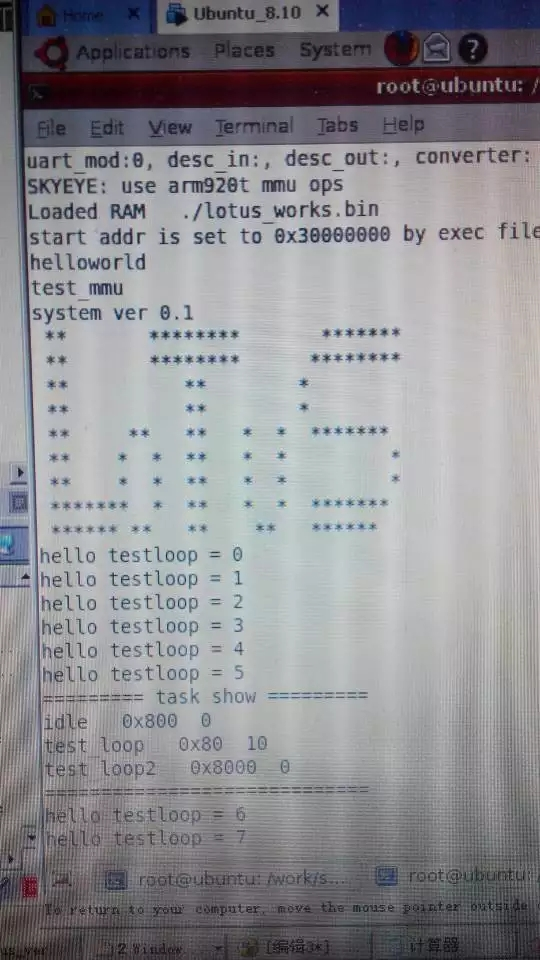
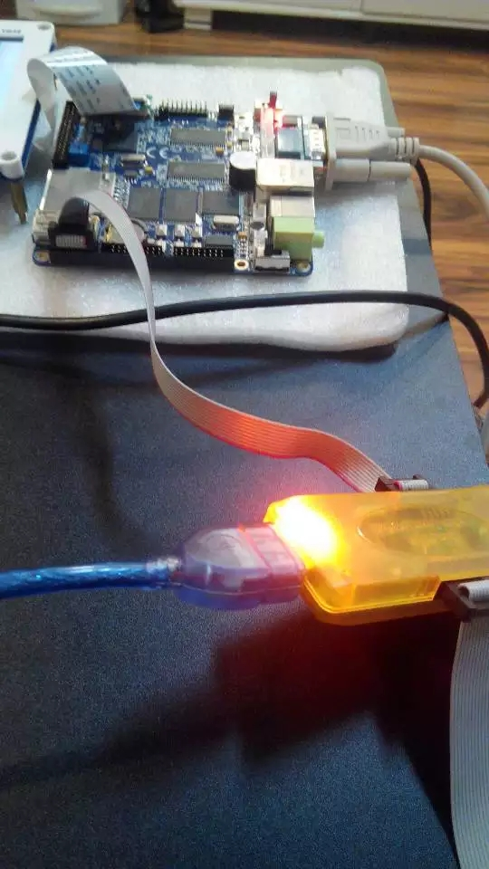
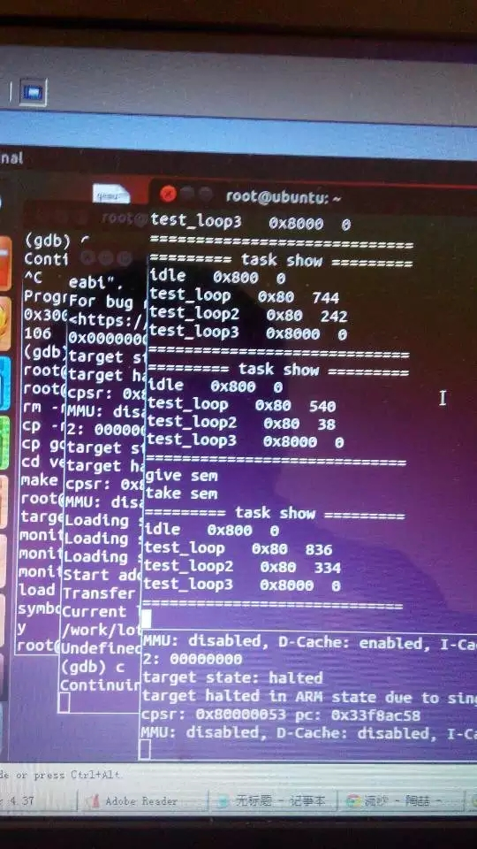
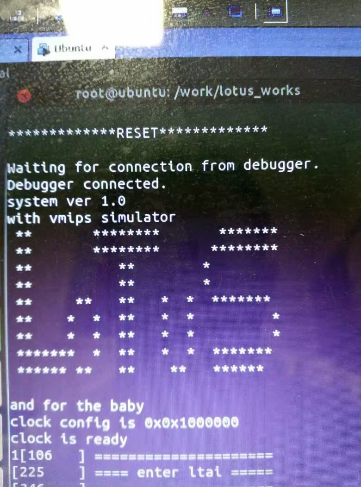
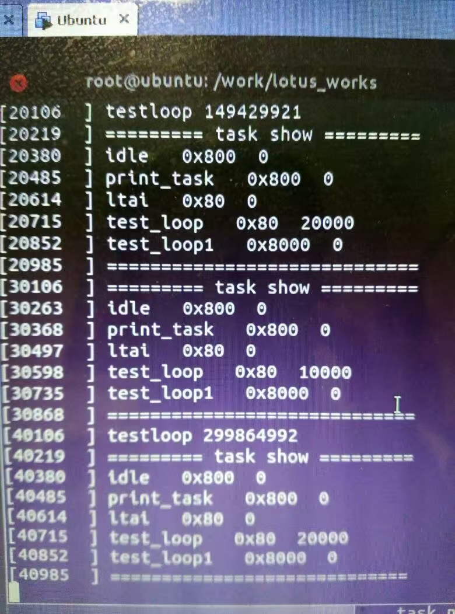
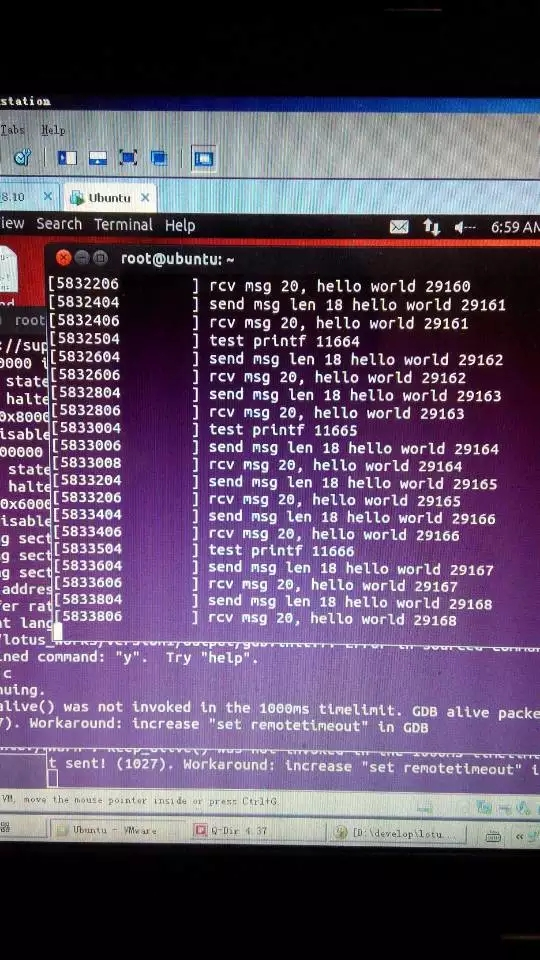

# Lotus Works

Lotus Works is a simple embedded OS that is made from scratch. It supports ARM and MIPS, contains
thread management, message, semaphore, and so on.

## ARM:

1. Skyeye simulator:

2. S3C2440 board:

## MIPS:

1. vMIPS simulator:

## Services:

1. Thread Management:

2. Message queue:

